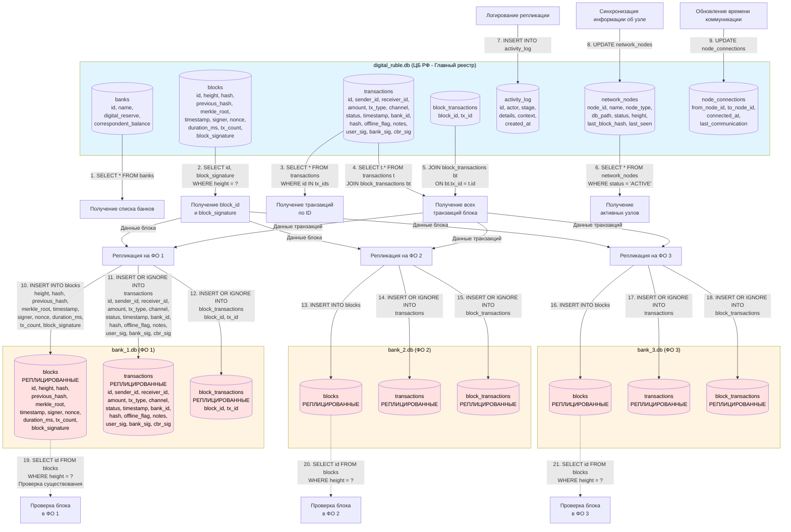
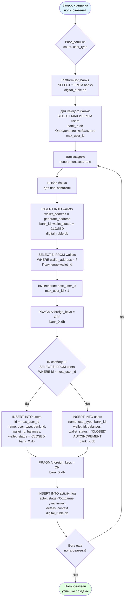

### 6.5. Блок-схема потока данных при репликации блоков

**Схема 17. Максимально развернутая блок-схема потока данных: репликация блоков с детальным взаимодействием БД**

```mermaid
flowchart LR
    START([Блок создан<br/>ledger.append_block]) --> GET_BLOCK_DATA[Platform._replicate_block_to_banks]
    
    GET_BLOCK_DATA --> LEGACY_START[_replicate_block_to_banks_legacy<br/>ГАРАНТИРОВАННАЯ РЕПЛИКАЦИЯ]
    
    LEGACY_START --> GET_BANKS[SELECT * FROM banks<br/>digital_ruble.db]
    
    GET_BANKS --> CHECK_BANKS{Есть банки?}
    CHECK_BANKS -->|Нет| END_LEGACY[Завершение legacy]
    CHECK_BANKS -->|Да| GET_TX_IDS[Извлечение tx_ids]
    
    GET_TX_IDS --> CHECK_TX_IDS{tx_ids<br/>не пуст?}
    CHECK_TX_IDS -->|Да| QUERY_TXS[SELECT * FROM transactions<br/>WHERE id IN tx_ids<br/>digital_ruble.db]
    CHECK_TX_IDS -->|Нет| EMPTY_TXS[full_txs = пустой]
    
    QUERY_TXS --> FULL_TXS[full_txs = dict rows]
    EMPTY_TXS --> GET_BLOCK_ID
    
    FULL_TXS --> GET_BLOCK_ID[SELECT id, block_signature<br/>FROM blocks<br/>WHERE height = ?<br/>digital_ruble.db]
    
    GET_BLOCK_ID --> CHECK_BLOCK_ID{block_id_row<br/>найден?}
    CHECK_BLOCK_ID -->|Да| GET_BLOCK_SIG[block_signature =<br/>block_id_row.get]
    CHECK_BLOCK_ID -->|Нет| NO_SIG[block_signature = None]
    
    GET_BLOCK_SIG --> GET_ALL_TXS[SELECT t.* FROM transactions t<br/>JOIN block_transactions bt<br/>WHERE bt.block_id = ?<br/>digital_ruble.db]
    
    NO_SIG --> USE_FULL_TXS[all_txs = full_txs]
    GET_ALL_TXS --> ALL_TXS[all_txs = все транзакции блока]
    
    USE_FULL_TXS --> LOOP_BANKS_START[ЦИКЛ: Для каждого банка]
    ALL_TXS --> LOOP_BANKS_START
    
    LOOP_BANKS_START --> BANK_ID[bank_id, bank_name]
    
    BANK_ID --> OPEN_BANK_DB[DatabaseManager<br/>bank_X.db]
    
    OPEN_BANK_DB --> DISABLE_FK[PRAGMA foreign_keys = OFF<br/>bank_X.db]
    
    DISABLE_FK --> CHECK_BLOCK_EXISTS[SELECT id FROM blocks<br/>WHERE height = ?<br/>bank_X.db]
    
    CHECK_BLOCK_EXISTS --> BLOCK_EXISTS{Блок<br/>существует?}
    
    BLOCK_EXISTS -->|Да| SKIP_BANK[Пропустить банк]
    BLOCK_EXISTS -->|Нет| INSERT_BLOCK[INSERT INTO blocks<br/>height, hash, previous_hash,<br/>merkle_root, timestamp, signer,<br/>nonce, duration_ms, tx_count,<br/>block_signature<br/>bank_X.db]
    
    INSERT_BLOCK --> GET_BLOCK_ID_BANK[SELECT id FROM blocks<br/>WHERE height = ?<br/>bank_X.db]
    
    GET_BLOCK_ID_BANK --> BLOCK_ID_BANK[block_id = block_row id]
    
    BLOCK_ID_BANK --> LOOP_TX_START[ЦИКЛ: Для каждой транзакции]
    
    LOOP_TX_START --> INSERT_TX[INSERT OR IGNORE INTO transactions<br/>id, sender_id, receiver_id,<br/>amount, tx_type, channel, status,<br/>timestamp, bank_id, hash,<br/>offline_flag, notes, user_sig,<br/>bank_sig, cbr_sig<br/>bank_X.db]
    
    INSERT_TX --> INSERT_BT[INSERT OR IGNORE INTO<br/>block_transactions<br/>block_id, tx_id<br/>bank_X.db]
    
    INSERT_BT --> CHECK_MORE_TX{Есть еще<br/>транзакции?}
    CHECK_MORE_TX -->|Да| LOOP_TX_START
    CHECK_MORE_TX -->|Нет| ENABLE_FK[PRAGMA foreign_keys = ON<br/>bank_X.db]
    
    ENABLE_FK --> LOG_REPL[INSERT INTO activity_log<br/>Репликация блока<br/>digital_ruble.db]
    
    LOG_REPL --> CHECK_MORE_BANKS{Есть еще<br/>банки?}
    CHECK_MORE_BANKS -->|Да| LOOP_BANKS_START
    CHECK_MORE_BANKS -->|Нет| END_LEGACY
    
    SKIP_BANK --> CHECK_MORE_BANKS
    
    END_LEGACY --> P2P_CHECK{Распределенная<br/>сеть включена?}
    
    P2P_CHECK -->|Нет| SUCCESS_LEGACY([Репликация<br/>завершена<br/>legacy метод])
    P2P_CHECK -->|Да| P2P_START[P2PNetwork.broadcast_block<br/>ДОПОЛНИТЕЛЬНАЯ РЕПЛИКАЦИЯ]
    
    P2P_START --> GET_FULL_TXS_P2P[Получение данных<br/>транзакций для P2P]
    
    GET_FULL_TXS_P2P --> CHECK_TX_IDS_P2P{tx_ids<br/>не пуст?}
    CHECK_TX_IDS_P2P -->|Да| QUERY_TXS_P2P[SELECT * FROM transactions<br/>WHERE id IN placeholders<br/>digital_ruble.db]
    CHECK_TX_IDS_P2P -->|Нет| EMPTY_TXS_P2P[full_txs = пустой]
    
    QUERY_TXS_P2P --> FULL_TXS_P2P[full_txs = dict rows]
    EMPTY_TXS_P2P --> CREATE_BLOCK_MSG
    
    FULL_TXS_P2P --> CREATE_BLOCK_MSG[Создание BlockMessage<br/>block_data, transactions,<br/>sender_node_id, timestamp]
    
    CREATE_BLOCK_MSG --> GET_ACTIVE_NODES[SELECT * FROM network_nodes<br/>WHERE status = 'ACTIVE'<br/>digital_ruble.db]
    
    GET_ACTIVE_NODES --> FILTER_NODES[Фильтрация узлов:<br/>node_id != current_node_id]
    
    FILTER_NODES --> LOOP_NODES_START[ЦИКЛ: Для каждого узла]
    
    LOOP_NODES_START --> CHECK_DB_EXISTS{БД узла<br/>существует?}
    
    CHECK_DB_EXISTS -->|Нет| SKIP_NODE[Пропустить узел]
    CHECK_DB_EXISTS -->|Да| OPEN_NODE_DB[DatabaseManager<br/>node.db_path]
    
    OPEN_NODE_DB --> DISABLE_FK_NODE[PRAGMA foreign_keys = OFF<br/>node.db_path]
    
    DISABLE_FK_NODE --> CHECK_BLOCK_EXISTS_NODE[SELECT id FROM blocks<br/>WHERE height = ?<br/>node.db_path]
    
    CHECK_BLOCK_EXISTS_NODE --> BLOCK_EXISTS_NODE{Блок<br/>существует?}
    
    BLOCK_EXISTS_NODE -->|Да| ENABLE_FK_NODE1[PRAGMA foreign_keys = ON<br/>return True]
    ENABLE_FK_NODE1 --> UPDATE_CONNECTION
    
    BLOCK_EXISTS_NODE -->|Нет| VALIDATE_BLOCK[_validate_block_for_node<br/>Проверка целостности,<br/>подписей, связи]
    
    VALIDATE_BLOCK --> VALID_RESULT{Блок<br/>валиден?}
    
    VALID_RESULT -->|Нет| ENABLE_FK_NODE2[PRAGMA foreign_keys = ON<br/>return False]
    ENABLE_FK_NODE2 --> SKIP_NODE
    
    VALID_RESULT -->|Да| INSERT_BLOCK_NODE[INSERT INTO blocks<br/>height, hash, previous_hash,<br/>merkle_root, timestamp, signer,<br/>nonce, duration_ms, tx_count<br/>node.db_path]
    
    INSERT_BLOCK_NODE --> GET_BLOCK_ID_NODE[SELECT id FROM blocks<br/>WHERE height = ?<br/>node.db_path]
    
    GET_BLOCK_ID_NODE --> BLOCK_ID_NODE[block_id = block_row id]
    
    BLOCK_ID_NODE --> LOOP_TX_NODE_START[ЦИКЛ: Для каждой транзакции]
    
    LOOP_TX_NODE_START --> INSERT_TX_NODE[INSERT OR IGNORE INTO transactions<br/>id, sender_id, receiver_id,<br/>amount, tx_type, channel, status,<br/>timestamp, bank_id, hash,<br/>offline_flag, notes, user_sig,<br/>bank_sig, cbr_sig<br/>node.db_path]
    
    INSERT_TX_NODE --> INSERT_BT_NODE[INSERT OR IGNORE INTO<br/>block_transactions<br/>block_id, tx_id<br/>node.db_path]
    
    INSERT_BT_NODE --> CHECK_MORE_TX_NODE{Есть еще<br/>транзакции?}
    CHECK_MORE_TX_NODE -->|Да| LOOP_TX_NODE_START
    CHECK_MORE_TX_NODE -->|Нет| ENABLE_FK_NODE3[PRAGMA foreign_keys = ON<br/>node.db_path]
    
    ENABLE_FK_NODE3 --> SYNC_NODE_INFO[UPDATE network_nodes<br/>SET height, last_block_hash,<br/>last_seen<br/>digital_ruble.db]
    
    SYNC_NODE_INFO --> UPDATE_CONNECTION[UPDATE node_connections<br/>SET last_communication<br/>digital_ruble.db]
    
    UPDATE_CONNECTION --> CHECK_MORE_NODES{Есть еще<br/>узлы?}
    CHECK_MORE_NODES -->|Да| LOOP_NODES_START
    CHECK_MORE_NODES -->|Нет| SUCCESS_P2P([P2P репликация<br/>завершена])
    
    SKIP_NODE --> CHECK_MORE_NODES
    
    SUCCESS_LEGACY --> FINAL_SUCCESS([РЕПЛИКАЦИЯ ЗАВЕРШЕНА<br/>Блок на всех узлах:<br/>digital_ruble.db ЦБ<br/>bank_1.db, bank_2.db, bank_N.db ФО<br/>Все активные P2P узлы])
    SUCCESS_P2P --> FINAL_SUCCESS
    
    style START fill:#e1f5ff,color:#000000
    style FINAL_SUCCESS fill:#e1ffe1,color:#000000
    style SKIP_BANK fill:#fff4e1,color:#000000
    style SKIP_NODE fill:#fff4e1,color:#000000
    style QUERY_TXS fill:#ffe1e1,color:#000000
    style QUERY_TXS_P2P fill:#ffe1e1,color:#000000
    style INSERT_BLOCK fill:#e1ffe1,color:#000000
    style INSERT_TX fill:#e1ffe1,color:#000000
    style INSERT_BT fill:#e1ffe1,color:#000000
    style INSERT_BLOCK_NODE fill:#e1ffe1,color:#000000
    style INSERT_TX_NODE fill:#e1ffe1,color:#000000
    style INSERT_BT_NODE fill:#e1ffe1,color:#000000
    style SYNC_NODE_INFO fill:#fff4e1,color:#000000
    style UPDATE_CONNECTION fill:#fff4e1,color:#000000
```

**Схема 17.1. Детальная схема взаимодействия БД при репликации блоков**

**Схема 17.1 (табличное представление в Mermaid по ГОСТ). Детальное взаимодействие БД при репликации блоков**

```mermaid
graph TB
    subgraph CBR["ЦБ РФ - digital_ruble.db (Главный реестр)"]
        direction TB
        
        CBR_BLOCKS["Таблица: blocks<br/>─────────────────<br/>НАЗНАЧЕНИЕ: Хранит блоки блокчейна<br/>ФУНКЦИИ: Содержит полную информацию о каждом<br/>блоке цепочки, включая хеш, подпись,<br/>Merkle root, метаданные создания<br/>─────────────────<br/>id: INTEGER<br/>height: INTEGER<br/>hash: TEXT<br/>previous_hash: TEXT<br/>merkle_root: TEXT<br/>timestamp: TEXT<br/>signer: TEXT<br/>nonce: INTEGER<br/>duration_ms: REAL<br/>tx_count: INTEGER<br/>block_signature: TEXT"]
        
        CBR_TX["Таблица: transactions<br/>─────────────────<br/>НАЗНАЧЕНИЕ: Хранит все транзакции системы<br/>ФУНКЦИИ: Содержит данные о переводах между<br/>пользователями, включая суммы, типы,<br/>каналы, статусы и цифровые подписи<br/>─────────────────<br/>id: TEXT<br/>sender_id: INTEGER<br/>receiver_id: INTEGER<br/>amount: REAL<br/>tx_type: TEXT<br/>channel: TEXT<br/>status: TEXT<br/>timestamp: TEXT<br/>bank_id: INTEGER<br/>hash: TEXT<br/>offline_flag: INTEGER<br/>notes: TEXT<br/>user_sig: TEXT<br/>bank_sig: TEXT<br/>cbr_sig: TEXT"]
        
        CBR_BT["Таблица: block_transactions<br/>─────────────────<br/>НАЗНАЧЕНИЕ: Связывает блоки с транзакциями<br/>ФУНКЦИИ: Обеспечивает связь многие-ко-многим<br/>между блоками и транзакциями, позволяет<br/>определить какие транзакции в каком блоке<br/>─────────────────<br/>block_id: INTEGER<br/>tx_id: TEXT"]
        
        CBR_BANKS["Таблица: banks<br/>─────────────────<br/>НАЗНАЧЕНИЕ: Хранит информацию о банках<br/>ФУНКЦИИ: Содержит данные финансовых организаций,<br/>их цифровые резервы, корреспондентские<br/>счета и метаданные создания<br/>─────────────────<br/>id: INTEGER<br/>name: TEXT<br/>digital_reserve: REAL<br/>correspondent_balance: REAL<br/>created_at: TEXT"]
        
        CBR_ACTIVITY["Таблица: activity_log<br/>─────────────────<br/>НАЗНАЧЕНИЕ: Журнал всех операций системы<br/>ФУНКЦИИ: Логирует действия участников системы,<br/>этапы выполнения операций, детали и контекст<br/>для аудита и отладки<br/>─────────────────<br/>id: INTEGER<br/>actor: TEXT<br/>stage: TEXT<br/>details: TEXT<br/>context: TEXT<br/>created_at: TEXT"]
        
        CBR_NODES["Таблица: network_nodes<br/>─────────────────<br/>НАЗНАЧЕНИЕ: Хранит информацию об узлах сети<br/>ФУНКЦИИ: Содержит данные о всех узлах распределенной<br/>сети, их статусы, высоту блокчейна, последний<br/>блок и время последнего контакта<br/>─────────────────<br/>node_id: TEXT<br/>name: TEXT<br/>node_type: TEXT<br/>db_path: TEXT<br/>status: TEXT<br/>height: INTEGER<br/>last_block_hash: TEXT<br/>last_seen: TEXT"]
    end

    subgraph BANK1["ФО 1 - bank_1.db (Реплицированные данные)"]
        direction TB
        
        B1_BLOCKS["Таблица: blocks<br/>РЕПЛИЦИРОВАННАЯ<br/>─────────────────<br/>НАЗНАЧЕНИЕ: Копия блоков из ЦБ<br/>ФУНКЦИИ: Обеспечивает локальный доступ к блокам,<br/>синхронизацию с главным реестром, проверку<br/>целостности данных на узле банка<br/>─────────────────<br/>id: INTEGER<br/>height: INTEGER<br/>hash: TEXT<br/>previous_hash: TEXT<br/>merkle_root: TEXT<br/>timestamp: TEXT<br/>signer: TEXT<br/>nonce: INTEGER<br/>duration_ms: REAL<br/>tx_count: INTEGER<br/>block_signature: TEXT"]
        
        B1_TX["Таблица: transactions<br/>РЕПЛИЦИРОВАННАЯ<br/>─────────────────<br/>НАЗНАЧЕНИЕ: Копия транзакций из ЦБ<br/>ФУНКЦИИ: Позволяет банку просматривать все транзакции,<br/>проверять их статусы, анализировать операции<br/>без обращения к центральному реестру<br/>─────────────────<br/>id: TEXT<br/>sender_id: INTEGER<br/>receiver_id: INTEGER<br/>amount: REAL<br/>tx_type: TEXT<br/>channel: TEXT<br/>status: TEXT<br/>timestamp: TEXT<br/>bank_id: INTEGER<br/>hash: TEXT<br/>offline_flag: INTEGER<br/>notes: TEXT<br/>user_sig: TEXT<br/>bank_sig: TEXT<br/>cbr_sig: TEXT"]
        
        B1_BT["Таблица: block_transactions<br/>РЕПЛИЦИРОВАННАЯ<br/>─────────────────<br/>НАЗНАЧЕНИЕ: Копия связей блок-транзакция<br/>ФУНКЦИИ: Обеспечивает локальный доступ к связям<br/>между блоками и транзакциями для быстрого<br/>поиска транзакций по блокам<br/>─────────────────<br/>block_id: INTEGER<br/>tx_id: TEXT"]
    end

    subgraph BANK2["ФО 2 - bank_2.db (Реплицированные данные)"]
        direction TB
        
        B2_BLOCKS["Таблица: blocks<br/>РЕПЛИЦИРОВАННАЯ<br/>─────────────────<br/>НАЗНАЧЕНИЕ: Копия блоков из ЦБ<br/>ФУНКЦИИ: Обеспечивает локальный доступ к блокам,<br/>синхронизацию с главным реестром, проверку<br/>целостности данных на узле банка<br/>─────────────────<br/>id: INTEGER<br/>height: INTEGER<br/>hash: TEXT<br/>previous_hash: TEXT<br/>merkle_root: TEXT<br/>timestamp: TEXT<br/>signer: TEXT<br/>nonce: INTEGER<br/>duration_ms: REAL<br/>tx_count: INTEGER<br/>block_signature: TEXT"]
        
        B2_TX["Таблица: transactions<br/>РЕПЛИЦИРОВАННАЯ<br/>─────────────────<br/>НАЗНАЧЕНИЕ: Копия транзакций из ЦБ<br/>ФУНКЦИИ: Позволяет банку просматривать все транзакции,<br/>проверять их статусы, анализировать операции<br/>без обращения к центральному реестру<br/>─────────────────<br/>id: TEXT<br/>sender_id: INTEGER<br/>receiver_id: INTEGER<br/>amount: REAL<br/>tx_type: TEXT<br/>channel: TEXT<br/>status: TEXT<br/>timestamp: TEXT<br/>bank_id: INTEGER<br/>hash: TEXT<br/>offline_flag: INTEGER<br/>notes: TEXT<br/>user_sig: TEXT<br/>bank_sig: TEXT<br/>cbr_sig: TEXT"]
        
        B2_BT["Таблица: block_transactions<br/>РЕПЛИЦИРОВАННАЯ<br/>─────────────────<br/>НАЗНАЧЕНИЕ: Копия связей блок-транзакция<br/>ФУНКЦИИ: Обеспечивает локальный доступ к связям<br/>между блоками и транзакциями для быстрого<br/>поиска транзакций по блокам<br/>─────────────────<br/>block_id: INTEGER<br/>tx_id: TEXT"]
    end

    subgraph BANK3["ФО 3 - bank_3.db (Реплицированные данные)"]
        direction TB
        
        B3_BLOCKS["Таблица: blocks<br/>РЕПЛИЦИРОВАННАЯ<br/>─────────────────<br/>НАЗНАЧЕНИЕ: Копия блоков из ЦБ<br/>ФУНКЦИИ: Обеспечивает локальный доступ к блокам,<br/>синхронизацию с главным реестром, проверку<br/>целостности данных на узле банка<br/>─────────────────<br/>id: INTEGER<br/>height: INTEGER<br/>hash: TEXT<br/>previous_hash: TEXT<br/>merkle_root: TEXT<br/>timestamp: TEXT<br/>signer: TEXT<br/>nonce: INTEGER<br/>duration_ms: REAL<br/>tx_count: INTEGER<br/>block_signature: TEXT"]
        
        B3_TX["Таблица: transactions<br/>РЕПЛИЦИРОВАННАЯ<br/>─────────────────<br/>НАЗНАЧЕНИЕ: Копия транзакций из ЦБ<br/>ФУНКЦИИ: Позволяет банку просматривать все транзакции,<br/>проверять их статусы, анализировать операции<br/>без обращения к центральному реестру<br/>─────────────────<br/>id: TEXT<br/>sender_id: INTEGER<br/>receiver_id: INTEGER<br/>amount: REAL<br/>tx_type: TEXT<br/>channel: TEXT<br/>status: TEXT<br/>timestamp: TEXT<br/>bank_id: INTEGER<br/>hash: TEXT<br/>offline_flag: INTEGER<br/>notes: TEXT<br/>user_sig: TEXT<br/>bank_sig: TEXT<br/>cbr_sig: TEXT"]
        
        B3_BT["Таблица: block_transactions<br/>РЕПЛИЦИРОВАННАЯ<br/>─────────────────<br/>НАЗНАЧЕНИЕ: Копия связей блок-транзакция<br/>ФУНКЦИИ: Обеспечивает локальный доступ к связям<br/>между блоками и транзакциями для быстрого<br/>поиска транзакций по блокам<br/>─────────────────<br/>block_id: INTEGER<br/>tx_id: TEXT"]
    end

    %% ШАГ 1: Получение списка банков
    CBR_BANKS -->|ШАГ 1: Получение списка банков<br/>SELECT * FROM banks| STEP1[ШАГ 1: Получение списка<br/>всех банков для репликации]

    %% ШАГ 2: Получение данных блока из ЦБ
    CBR_BLOCKS -->|ШАГ 2: Получение данных блока<br/>SELECT id, block_signature<br/>FROM blocks<br/>WHERE height = ?| STEP2[ШАГ 2: Получение данных блока<br/>и его подписи из ЦБ]

    %% ШАГ 3: Получение всех транзакций блока
    CBR_TX -->|ШАГ 3: Получение транзакций<br/>SELECT t.* FROM transactions t| STEP3[ШАГ 3: Получение всех<br/>транзакций блока]
    CBR_BT -->|JOIN block_transactions bt<br/>ON bt.tx_id = t.id<br/>WHERE bt.block_id = ?| STEP3

    STEP1 --> STEP4[ШАГ 4: Начало репликации<br/>на все банки]
    STEP2 --> STEP4
    STEP3 --> STEP4

    %% ШАГ 5: Репликация блоков на банки
    STEP4 -->|ШАГ 5: Вставка блока в ФО 1<br/>INSERT INTO blocks<br/>height, hash, previous_hash,<br/>merkle_root, timestamp, signer,<br/>nonce, duration_ms, tx_count,<br/>block_signature| B1_BLOCKS
    
    STEP4 -->|ШАГ 6: Вставка блока в ФО 2<br/>INSERT INTO blocks| B2_BLOCKS
    
    STEP4 -->|ШАГ 7: Вставка блока в ФО 3<br/>INSERT INTO blocks| B3_BLOCKS

    %% ШАГ 8: Репликация транзакций
    STEP4 -->|ШАГ 8: Вставка транзакций в ФО 1<br/>INSERT OR IGNORE INTO transactions<br/>id, sender_id, receiver_id,<br/>amount, tx_type, channel, status,<br/>timestamp, bank_id, hash,<br/>offline_flag, notes, user_sig,<br/>bank_sig, cbr_sig| B1_TX
    
    STEP4 -->|ШАГ 9: Вставка транзакций в ФО 2<br/>INSERT OR IGNORE INTO transactions| B2_TX
    
    STEP4 -->|ШАГ 10: Вставка транзакций в ФО 3<br/>INSERT OR IGNORE INTO transactions| B3_TX

    %% ШАГ 11: Репликация связей блок-транзакция
    STEP4 -->|ШАГ 11: Вставка связей в ФО 1<br/>INSERT OR IGNORE INTO<br/>block_transactions<br/>block_id, tx_id| B1_BT
    
    STEP4 -->|ШАГ 12: Вставка связей в ФО 2<br/>INSERT OR IGNORE INTO<br/>block_transactions| B2_BT
    
    STEP4 -->|ШАГ 13: Вставка связей в ФО 3<br/>INSERT OR IGNORE INTO<br/>block_transactions| B3_BT

    %% ШАГ 14: Проверка репликации
    B1_BLOCKS -.->|ШАГ 14: Проверка репликации в ФО 1<br/>SELECT id FROM blocks<br/>WHERE height = ?| STEP5[ШАГ 14: Проверка успешности<br/>репликации на всех узлах]
    
    B2_BLOCKS -.->|ШАГ 15: Проверка репликации в ФО 2<br/>SELECT id FROM blocks<br/>WHERE height = ?| STEP5
    
    B3_BLOCKS -.->|ШАГ 16: Проверка репликации в ФО 3<br/>SELECT id FROM blocks<br/>WHERE height = ?| STEP5

    %% ШАГ 17: Логирование
    STEP5 -->|ШАГ 17: Логирование репликации<br/>INSERT INTO activity_log<br/>actor, stage, details, context| CBR_ACTIVITY

    %% ШАГ 18: Синхронизация информации об узлах
    STEP5 -->|ШАГ 18: Обновление информации об узлах<br/>UPDATE network_nodes<br/>SET height, last_block_hash,<br/>last_seen| CBR_NODES

    style CBR fill:#e1f5ff,color:#000000
    style BANK1 fill:#fff4e1,color:#000000
    style BANK2 fill:#fff4e1,color:#000000
    style BANK3 fill:#fff4e1,color:#000000
    style CBR_BLOCKS fill:#ffffff,color:#000000
    style CBR_TX fill:#ffffff,color:#000000
    style CBR_BT fill:#ffffff,color:#000000
    style CBR_BANKS fill:#ffffff,color:#000000
    style CBR_ACTIVITY fill:#ffffff,color:#000000
    style CBR_NODES fill:#ffffff,color:#000000
    style B1_BLOCKS fill:#ffe8d4,color:#000000
    style B1_TX fill:#ffe8d4,color:#000000
    style B1_BT fill:#ffe8d4,color:#000000
    style B2_BLOCKS fill:#ffe8d4,color:#000000
    style B2_TX fill:#ffe8d4,color:#000000
    style B2_BT fill:#ffe8d4,color:#000000
    style B3_BLOCKS fill:#ffe8d4,color:#000000
    style B3_TX fill:#ffe8d4,color:#000000
    style B3_BT fill:#ffe8d4,color:#000000
    style STEP1 fill:#e1ffe1,color:#000000
    style STEP2 fill:#e1ffe1,color:#000000
    style STEP3 fill:#e1ffe1,color:#000000
    style STEP4 fill:#e1ffe1,color:#000000
    style STEP5 fill:#e1ffe1,color:#000000
```

### 6.6. Диаграмма потоков данных при создании пользователей

**Схема 18. Блок-схема потока данных: создание пользователей**

### 6.7. Схема синхронизации блоков распределенного реестра

**Схема 19. Блок-схема синхронизации блоков между узлами распределенного реестра**

```mermaid
flowchart TD
    START([Инициация синхронизации<br/>P2PNetwork.request_sync]) --> GET_LOCAL_STATE[ШАГ 1: Получение локального состояния<br/>ledger.get_last_block<br/>SELECT * FROM blocks<br/>ORDER BY height DESC LIMIT 1<br/>local_node.db]
    
    GET_LOCAL_STATE --> LOCAL_HEIGHT[Определение локальной высоты<br/>our_height = last_block.height<br/>our_hash = last_block.hash]
    
    LOCAL_HEIGHT --> GET_TARGET_NODE[ШАГ 2: Выбор целевого узла<br/>node_manager.get_active_nodes<br/>Выбор узла для синхронизации]
    
    GET_TARGET_NODE --> OPEN_TARGET_DB[ШАГ 3: Открытие БД целевого узла<br/>DatabaseManager<br/>target_node.db_path]
    
    OPEN_TARGET_DB --> GET_TARGET_STATE[ШАГ 4: Получение состояния целевого узла<br/>SELECT * FROM blocks<br/>ORDER BY height DESC LIMIT 1<br/>target_node.db]
    
    GET_TARGET_STATE --> TARGET_HEIGHT[Определение высоты целевого узла<br/>target_height = target_block.height<br/>target_hash = target_block.hash]
    
    TARGET_HEIGHT --> COMPARE_HEIGHTS{ШАГ 5: Сравнение высот<br/>target_height > our_height?}
    
    COMPARE_HEIGHTS -->|Нет| NO_SYNC_NEEDED([Синхронизация не требуется<br/>Локальный узел актуален])
    
    COMPARE_HEIGHTS -->|Да| CALC_MISSING[ШАГ 6: Расчет недостающих блоков<br/>missing_blocks =<br/>target_height - our_height]
    
    CALC_MISSING --> LOOP_BLOCKS_START[ШАГ 7: ЦИКЛ: Для каждого<br/>недостающего блока]
    
    LOOP_BLOCKS_START --> REQUEST_BLOCK[ШАГ 8: Запрос блока<br/>SELECT * FROM blocks<br/>WHERE height = ?<br/>target_node.db]
    
    REQUEST_BLOCK --> GET_BLOCK_TXS[ШАГ 9: Получение транзакций блока<br/>SELECT t.* FROM transactions t<br/>JOIN block_transactions bt<br/>ON bt.tx_id = t.id<br/>WHERE bt.block_id = ?<br/>target_node.db]
    
    GET_BLOCK_TXS --> VALIDATE_BLOCK[ШАГ 10: Валидация блока<br/>Проверка целостности:<br/>- Проверка хеша<br/>- Проверка previous_hash<br/>- Проверка подписи ЦБ<br/>- Проверка Merkle root]
    
    VALIDATE_BLOCK --> VALID_RESULT{Блок валиден?}
    
    VALID_RESULT -->|Нет| SKIP_BLOCK[Пропустить блок<br/>Логирование ошибки]
    
    VALID_RESULT -->|Да| DISABLE_FK[ШАГ 11: Отключение внешних ключей<br/>PRAGMA foreign_keys = OFF<br/>local_node.db]
    
    DISABLE_FK --> CHECK_BLOCK_EXISTS[ШАГ 12: Проверка существования блока<br/>SELECT id FROM blocks<br/>WHERE height = ?<br/>local_node.db]
    
    CHECK_BLOCK_EXISTS --> BLOCK_EXISTS{Блок уже<br/>существует?}
    
    BLOCK_EXISTS -->|Да| SKIP_BLOCK
    BLOCK_EXISTS -->|Нет| INSERT_BLOCK[ШАГ 13: Вставка блока<br/>INSERT INTO blocks<br/>height, hash, previous_hash,<br/>merkle_root, timestamp, signer,<br/>nonce, duration_ms, tx_count,<br/>block_signature<br/>local_node.db]
    
    INSERT_BLOCK --> GET_BLOCK_ID[ШАГ 14: Получение ID блока<br/>SELECT id FROM blocks<br/>WHERE height = ?<br/>local_node.db]
    
    GET_BLOCK_ID --> LOOP_TX_START[ШАГ 15: ЦИКЛ: Для каждой<br/>транзакции блока]
    
    LOOP_TX_START --> INSERT_TX[ШАГ 16: Вставка транзакции<br/>INSERT OR IGNORE INTO transactions<br/>id, sender_id, receiver_id,<br/>amount, tx_type, channel, status,<br/>timestamp, bank_id, hash,<br/>offline_flag, notes, user_sig,<br/>bank_sig, cbr_sig<br/>local_node.db]
    
    INSERT_TX --> INSERT_BT[ШАГ 17: Вставка связи блок-транзакция<br/>INSERT OR IGNORE INTO<br/>block_transactions<br/>block_id, tx_id<br/>local_node.db]
    
    INSERT_BT --> CHECK_MORE_TX{Есть еще<br/>транзакции?}
    
    CHECK_MORE_TX -->|Да| LOOP_TX_START
    CHECK_MORE_TX -->|Нет| ENABLE_FK[ШАГ 18: Включение внешних ключей<br/>PRAGMA foreign_keys = ON<br/>local_node.db]
    
    ENABLE_FK --> UPDATE_NODE_INFO[ШАГ 19: Обновление информации об узле<br/>UPDATE network_nodes<br/>SET height = ?,<br/>last_block_hash = ?,<br/>last_seen = CURRENT_TIMESTAMP<br/>WHERE node_id = ?<br/>central_db]
    
    UPDATE_NODE_INFO --> CHECK_MORE_BLOCKS{Есть еще<br/>блоки?}
    
    CHECK_MORE_BLOCKS -->|Да| LOOP_BLOCKS_START
    CHECK_MORE_BLOCKS -->|Нет| SYNC_COMPLETE([ШАГ 20: Синхронизация завершена<br/>Все блоки синхронизированы<br/>Локальный узел обновлен])
    
    SKIP_BLOCK --> CHECK_MORE_BLOCKS
    
    style START fill:#e1f5ff,color:#000000
    style NO_SYNC_NEEDED fill:#fff4e1,color:#000000
    style SYNC_COMPLETE fill:#e1ffe1,color:#000000
    style GET_LOCAL_STATE fill:#e1ffe1,color:#000000
    style GET_TARGET_STATE fill:#e1ffe1,color:#000000
    style VALIDATE_BLOCK fill:#ffe1e1,color:#000000
    style INSERT_BLOCK fill:#e1ffe1,color:#000000
    style INSERT_TX fill:#e1ffe1,color:#000000
    style INSERT_BT fill:#e1ffe1,color:#000000
    style UPDATE_NODE_INFO fill:#fff4e1,color:#000000
    style SKIP_BLOCK fill:#fff4e1,color:#000000
```

**Описание процесса синхронизации:**

1. **Инициация синхронизации**: Узел инициирует процесс синхронизации для обновления своего блокчейна.

2. **Получение локального состояния**: Определяется текущая высота блокчейна и хеш последнего блока на локальном узле.

3. **Выбор целевого узла**: Выбирается активный узел сети для синхронизации.

4. **Получение состояния целевого узла**: Определяется высота блокчейна на целевом узле.

5. **Сравнение высот**: Сравниваются высоты локального и целевого узлов. Если целевой узел имеет большую высоту, начинается синхронизация.

6. **Расчет недостающих блоков**: Вычисляется количество блоков, которые необходимо синхронизировать.

7. **Запрос и валидация блоков**: Для каждого недостающего блока выполняется запрос, получение транзакций и валидация целостности.

8. **Вставка блоков**: Валидированные блоки и их транзакции вставляются в локальную БД узла.

9. **Обновление состояния**: Информация об узле обновляется в центральной БД с новой высотой и хешем последнего блока.

10. **Завершение**: После синхронизации всех недостающих блоков локальный узел полностью синхронизирован с сетью.

Все диаграммы потоков данных соответствуют реальной реализации в коде и показывают детальные потоки данных между компонентами системы.
